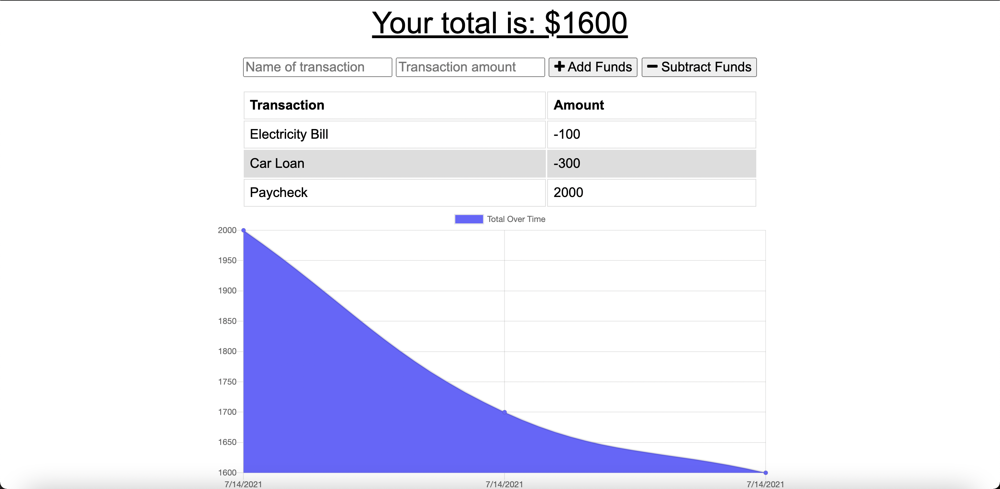

# Progressive Budget Tracker
  ## Licensing:
  
  ## Table of Contents 
  - [Description](#description)
  - [Usage](#usage)
  - [Contribution](#contribution)
  - [Testing](#testing)
  - [Questions?](#questions)
  ## Description:
  This application allows the user to add expenses and deposits to their budget with or without an internet connection. If the transactions are offline, the data will populate once the connection is back online. This allows the user to track their budget with or without internet while traveling at anytime.
  ## Usage:
  You can enter deposits or expenses and it will update your budget tracker accordingly. Offline updates will populate once you reestablish an internet connection.
  

  ## License:
  
  Copyright © Thang Nguyen. All rights reserved. 
  Licensed under the [MIT](https://opensource.org/licenses/MIT) license.
  ## Contribution:
  Anyone can contribute.
  ## Testing:
  Please visit the deployed link to test this application's functionality.
  ## Questions?
  - Github: [thangnt336](https://github.com/thangnt336)
  - Email: thangnt336@gmail.com 
